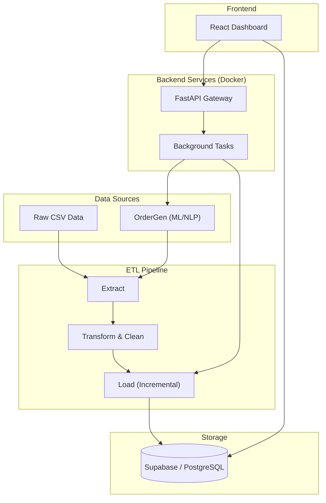

# Brazilian Retail Intelligence System (BRIS)


**A comprehensive, end-to-end Data Engineering and Business Intelligence solution.**

This project demonstrates a full-stack approach to data systems, encompassing everything from raw data extraction and transformation to synthetic data generation, API development, and frontend visualization. It is designed to simulate a high-scale, professional retail analytics environment.

---

## System Architecture

The system is built on a modular microservices architecture, separating concerns between data processing, storage, and presentation.



---

## Key Features

### 1. Dual-Environment ETL Pipeline
*   **Local Development**: Uses `SQLAlchemy` for rapid iteration with local PostgreSQL instances.
*   **Production**: Uses `supabase-py` for direct, secure HTTP-based data loading.
*   **Incremental Loading**: Smart upsert logic ensures only new or modified records are processed, minimizing database load and costs.

### 2. Intelligent Data Generation (OrderGen)
*   **Synthetic Data Engine**: A custom Python module that "learns" from existing data distributions to generate realistic new orders.
*   **NLP-Powered Reviews**: Implements a **Markov Chain** model to generate authentic-sounding customer review comments in Portuguese based on real dataset patterns.
*   **Backfill Capability**: Can generate historical data to fill gaps or simulate traffic spikes.

### 3. Production-Ready Backend
*   **FastAPI Service**: Exposes REST endpoints to trigger ETL jobs and data generation tasks.
*   **Dockerized**: Fully containerized application ensuring consistency across development and deployment environments.
*   **Asynchronous Processing**: Uses background tasks for long-running data operations to keep the API responsive.

### 4. Robust Database Design
*   **Schema Management**: Python-based schema migration and creation scripts.
*   **Data Integrity**: Automated setup of Foreign Keys, Constraints, and Indexes to ensure data quality and query performance.
*   **Security**: Row Level Security (RLS) ready architecture.

### 5. Modern Frontend Dashboard
*   **Tech Stack**: React, TypeScript, Vite, Tailwind CSS.
*   **Visualization**: Interactive charts and metrics visualizing Revenue, Customer Behavior, and Logistics efficiency.

---

## Technical Stack

| Domain | Technologies |
|--------|--------------|
| **Data Engineering** | Python, Pandas, NumPy, SQLAlchemy |
| **Backend API** | FastAPI, Uvicorn, Pydantic |
| **Database** | PostgreSQL, Supabase (Cloud) |
| **DevOps** | Docker, Bash Scripting, Git |
| **Frontend** | React, TypeScript, Vite, Tailwind CSS |
| **Data Science** | Scikit-learn (concepts), Markov Chains, Faker |

---

## Project Structure

```
├── api/                 # FastAPI backend application
├── dashboard/           # React frontend application
├── data/                # Raw CSV datasets
├── db_schema/           # Database schema definitions & constraints
├── docs/                # Documentation & PDFs
├── etl_local/           # Local ETL pipeline (SQLAlchemy)
├── etl_prod/            # Production ETL pipeline (Supabase)
├── ordergen/            # Synthetic data generator (ML/NLP)
├── Dockerfile           # Container definition
├── requirements.txt     # Python dependencies
└── run_docker.sh        # Deployment script
```

---

## Getting Started

### Prerequisites
*   Docker & Docker Compose
*   Python 3.10+
*   Node.js 18+ (for frontend)

### Option A: Run with Docker (Recommended)

This will start the Backend API, ETL, and Order Generator in a single container.

1.  **Configure Environment**:
    Create a `.env` file with your Supabase credentials:
    ```env
    SUPABASE_URL=https://your-project.supabase.co
    SUPERKEY=your-service-role-key
    ```

2.  **Build and Run**:
    ```bash
    ./run_docker.sh
    ```

3.  **Interact with API**:
    *   Health Check: `http://localhost:8000/health`
    *   Generate Orders:
        ```bash
        curl -X POST http://localhost:8000/orders/generate \
             -H "Content-Type: application/json" \
             -d '{"count": 10}'
        ```

### Option B: Local Development

1.  **Install Dependencies**:
    ```bash
    pip install -r requirements.txt
    ```

2.  **Run ETL Locally**:
    ```bash
    python -m etl_local.main
    ```

3.  **Start Frontend**:
    ```bash
    cd dashboard
    npm install
    npm run dev
    ```

---

## 📚 Documentation

Detailed documentation is available in the `docs/` folder:
*   [System Overview](docs/system_overview.pdf)
*   [Database Setup](docs/database_setup.pdf)
*   [ETL Pipeline Setup](docs/etl_setup.pdf)

---

## Author

**TADSTech**<br>
*Full Stack Data Engineer & Software Developer*

Built during Ungodly hours and using Python and Coffee.
